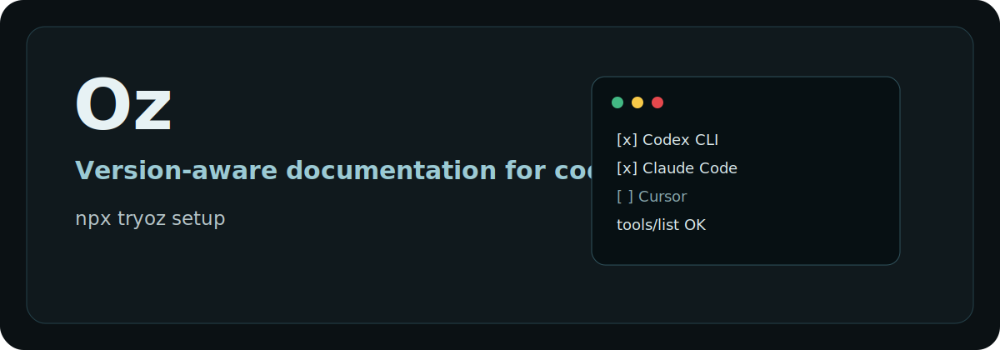
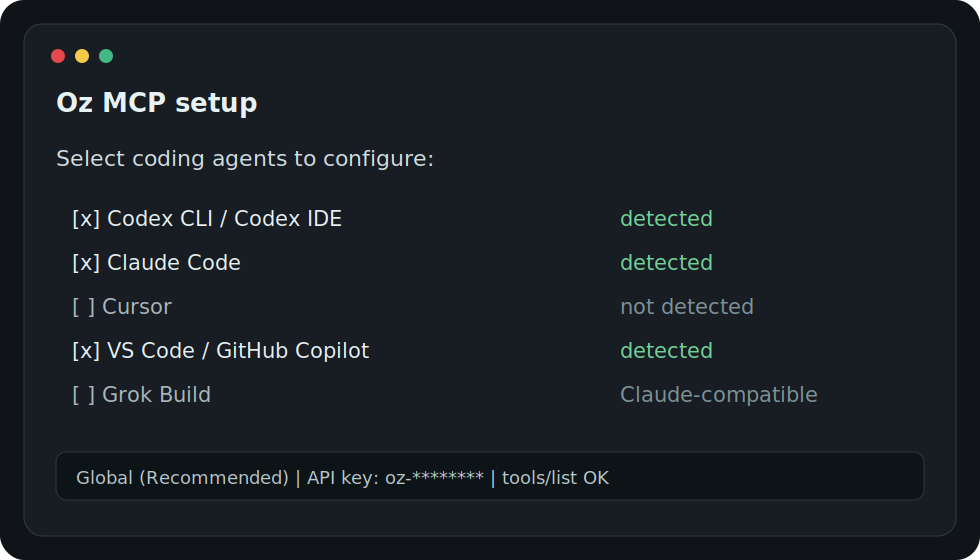

<p align="center">
  
</p>

# Oz MCP Setup

[](https://www.npmjs.com/package/tryoz)
[](./LICENSE)
[](https://github.com/Sricharan07/tryoz/actions/workflows/ci.yml)
[](https://tryoz.dev)

One-line setup for Oz, a version-aware documentation MCP server for coding agents.

```bash
npx tryoz setup
```

Oz gives agents a repeatable workflow for external library, SDK, framework, API,
and package questions:

1. Resolve the exact library ID.
2. Fetch version-aware docs and code examples.
3. Use exact API symbols, routes, env vars, config keys, and CLI flags from the returned context.
4. Fall back to Context7, official docs, source repositories, or web search only when Oz does not have enough coverage.

## Why Oz

Without a documentation MCP, coding agents often answer from old training data,
guess APIs, or mix docs from the wrong major version.

With Oz, your agent can ask for the current indexed documentation at the moment
it needs context.

```txt
User: Add Next.js middleware auth for v15.
Agent: resolve-library-id -> /vercel/next.js
Agent: get-library-docs -> version v15, topic middleware auth
Agent: answers from retrieved docs instead of guessing.
```

## Setup Flow

`npx tryoz setup` is interactive by default:

<p align="center">
  
</p>

The setup wizard:

1. Detects installed coding agents.
2. Shows a checkbox list so you can select one or many agents.
3. Asks for scope: Global (recommended) or Project.
4. Asks for an Oz API key. Keys must start with `oz-`.
5. Shows the exact files and commands that will change.
6. Installs the Oz MCP config.
7. Installs the Oz skill or the best available rule fallback.
8. Verifies the MCP server with `tools/list`.

No login flow. No broad hidden patching. Only selected agents are changed.

## Supported Agents

| Agent | Global | Project | Skill or policy |
| --- | --- | --- | --- |
| Codex CLI / Codex IDE | Yes | Yes | Codex skill + `AGENTS.md` for project scope |
| Claude Code | Yes | Yes | Claude skill + `CLAUDE.md` for project scope |
| Cursor | Yes | Yes | Cursor rule |
| VS Code / GitHub Copilot | Yes | Yes | Copilot instructions for project scope |
| Cline | Yes | Yes | MCP config + `AGENTS.md` for project scope |
| Windsurf | Yes | Yes | Windsurf rules |
| OpenCode | Yes | Yes | OpenCode config + policy |
| GitHub Copilot CLI | Yes | Yes | MCP config |
| GitHub Copilot Coding Agent | Project | Yes | Repository MCP config |
| Grok Build | Yes | Yes | Claude-compatible project policy |
| Gemini CLI | Policy | Policy | `GEMINI.md` policy |

## Common Commands

```bash
# Interactive setup
npx tryoz setup

# Non-interactive setup
npx tryoz setup --codex --claude --global --api-key oz-your-key
npx tryoz setup --all --project --api-key oz-your-key

# Remove Oz-owned config only
npx tryoz remove
npx tryoz remove --codex --claude --global

# Verify the remote MCP endpoint
npx tryoz mcp test --api-key oz-your-key

# Inspect local agent config health
npx tryoz doctor --api-key oz-your-key

# List detected clients
npx tryoz list-agents
npx tryoz detect
```

## Manual MCP Config

Use this endpoint for clients that you configure manually:

```txt
https://tryoz.dev/mcp
```

Pass your API key as a bearer token:

```json
{
  "mcpServers": {
    "oz": {
      "type": "http",
      "url": "https://tryoz.dev/mcp",
      "headers": {
        "Authorization": "Bearer oz-your-key"
      }
    }
  }
}
```

## Installed Skill

The bundled Oz skill and policy tell agents:

```md
Use Oz first for external libraries, SDKs, APIs, frameworks, and packages.

Workflow:
1. Call `resolve-library-id` to find the exact Oz library ID.
2. Call `get-library-docs` with the resolved library ID and the user's topic.
3. If the user asks for a version, pass the version explicitly.
4. Use the returned documentation as the source of truth.
5. If Oz has no matching library, lacks the requested version, or returns insufficient context, then fall back to Context7, official docs, source repositories, or web search.
```

The full skill is packaged at `templates/skills/oz/SKILL.md`.

## Documentation

- [Installation](./docs/installation.md)
- [CLI reference](./docs/cli.md)
- [Client setup guides](./docs/clients/README.md)
- [Oz skill and policy](./docs/skills.md)
- [Troubleshooting](./docs/troubleshooting.md)
- [Telemetry](./docs/telemetry.md)
- [Security](./docs/security.md)
- [Development](./docs/development.md)

## Development

```bash
npm install
npm test
npm run pack:check
node bin/tryoz.js setup --dry-run --no-telemetry
```

## Telemetry

Anonymous CLI telemetry records only command name, selected client IDs,
OS/platform, success/failure, and CLI version. It does not send prompts, file
contents, API keys, or absolute repository paths.

Disable telemetry with:

```bash
npx tryoz setup --no-telemetry
```

## Security

Report security issues privately. See [SECURITY.md](./SECURITY.md).

## Disclaimer

This repository contains the public Oz setup CLI, agent skills, rules, and docs.
The hosted Oz indexing backend, crawler, vector store, and production dashboard
are separate service components.

Oz indexes third-party documentation. Always validate critical changes against
the upstream library or API owner when correctness or security matters.

## License

MIT
